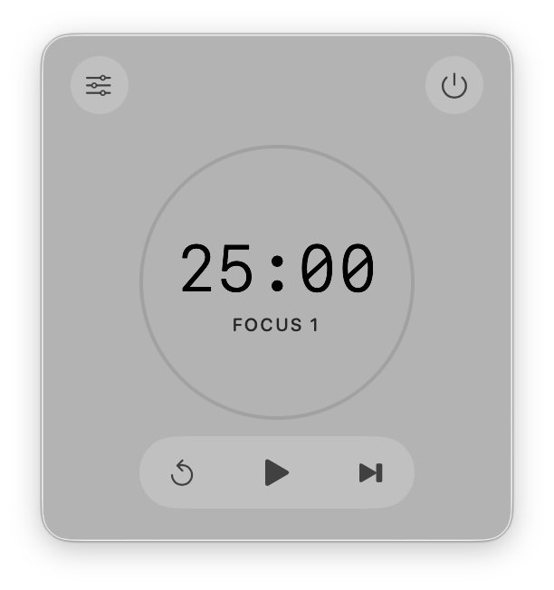
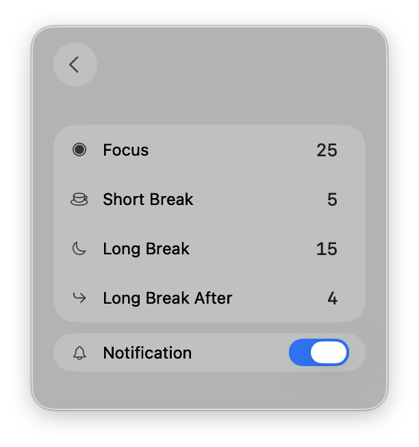

# Pomodoro Bar

A minimal macOS menu bar Pomodoro timer built with SwiftUI.

## Features

- **Menu bar timer** - Lives in your menu bar, always accessible
- **Pomodoro technique** - Focus sessions with short and long breaks
- **Progress ring** - Visual animated progress indicator
- **Customizable durations** - Configure focus, short break, and long break times
- **Notifications** - macOS notifications when phases complete
- **Quick controls** - Start, pause, reset, and skip from the menu bar
- **Persistent settings** - Durations and preferences are saved between launches
- **Cycle tracking** - Dots show your progress toward the long break

## Screenshots




## Requirements

- macOS 26.0+ (Liquid Glass)
- Xcode 26.0+

## Build & Install

```bash
xcodebuild -scheme PomodoroBar -configuration Debug build CODE_SIGNING_ALLOWED=NO -derivedDataPath build && \
rm -rf /Applications/PomodoroBar.app && \
cp -R build/Build/Products/Debug/PomodoroBar.app /Applications/ && \
codesign --force --sign - --deep /Applications/PomodoroBar.app
```

Then open from Applications or run:
```bash
open /Applications/PomodoroBar.app
```

## Publishing a Release

Releases are automated with GitHub Actions. Pushing a version tag builds the
app on a GitHub-hosted macOS runner, then creates a GitHub Release with the
app binary and auto-generated release notes attached.

1. Bump the version in the Xcode project: select the `PomodoroBar` target →
   **General** → update **Version** (and the marketing version in the project file
   if needed).
2. Commit and push your changes, then create and push a tag matching the
   version:

   ```bash
   git tag v0.0.1
   git push origin refs/tags/v0.0.1
   ```

   The `refs/tags/` prefix makes it explicit that you're pushing the tag, so
   it can't be confused with a branch of the same name.

3. The workflow runs in **Actions**: a build job compiles the app and uploads
   it, then a release job creates a **draft** release on the
   [Releases](https://github.com/thanhqng1510/pomodoro-bar/releases) page.
4. Open the draft release, review/edit the notes, and click **Publish release**.

Each release automatically includes the **source code** (a zip/tar.gz archive)
and the built `PomodoroBar-v<ver>.zip` plus a `checksums.txt` file. Because the
app is not notarized, first-time users on macOS will see an "unidentified
developer" warning and must right-click → **Open** to launch it.

## Default Settings

| Setting | Duration |
|---------|----------|
| Focus | 25 min |
| Short Break | 5 min |
| Long Break | 15 min |
| Long Break After | 4 pomodoros |

## Project Structure

```
PomodoroBarApp.swift   - App entry point, notification delegate
TimerModel.swift       - Timer logic, state management, notifications
TimerRingView.swift    - Animated circular progress ring
MenuBarView.swift      - Main UI with controls and settings
Assets.xcassets/       - App icons, accent colors, phase colors
```

## License

MIT
